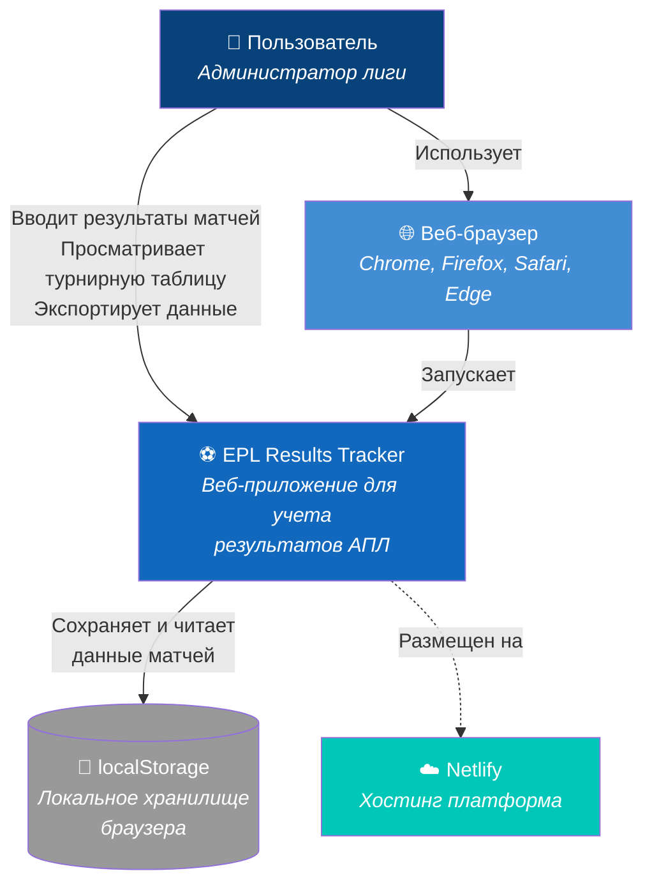

# Архитектура приложения

## 1. Общий обзор

EPL Results Tracker - это одностраничное веб-приложение (SPA), работающее полностью на стороне клиента без необходимости в серверной части.

### 1.1 C4 Context Diagram



### 1.2 Архитектура приложения

```
┌─────────────────────────────────────────┐
│          Пользователь                   │
└────────────────┬────────────────────────┘
                 │
┌────────────────▼────────────────────────┐
│         StatiCrypt защита               │
│      (Парольная аутентификация)         │
└────────────────┬────────────────────────┘
                 │
┌────────────────▼────────────────────────┐
│          HTML/CSS/JS                    │
│    ┌─────────────────────────┐         │
│    │    Пользовательский     │         │
│    │      интерфейс          │         │
│    └──────────┬──────────────┘         │
│               │                         │
│    ┌──────────▼──────────────┐         │
│    │    Бизнес-логика        │         │
│    │  (Расчет таблицы)       │         │
│    └──────────┬──────────────┘         │
│               │                         │
│    ┌──────────▼──────────────┐         │
│    │   Управление данными     │         │
│    │    (localStorage)        │         │
│    └─────────────────────────┘         │
└─────────────────────────────────────────┘
```

## 2. Компоненты системы

### 2.1 Презентационный слой (UI)
- **Форма ввода матчей:** Выбор команд и ввод счета
- **Таблица результатов:** Отображение всех введенных матчей
- **Турнирная таблица:** Актуальное положение команд
- **Панель управления:** Экспорт данных, очистка

### 2.2 Логический слой
- **Match Manager:** Обработка добавления/удаления матчей
- **Table Calculator:** Расчет статистики и сортировка команд
- **Data Validator:** Проверка корректности вводимых данных

### 2.3 Слой данных
- **Storage Manager:** Абстракция над localStorage
- **Data Models:** Структуры для команд, матчей, таблицы
- **Export/Import:** Функции резервного копирования

## 3. Поток данных

```
Ввод результата → Валидация → Сохранение в localStorage
                                    ↓
Отображение ← Расчет таблицы ← Чтение данных
```

## 4. Технологические решения

### 4.1 Выбор технологий

| Компонент | Технология | Обоснование |
|-----------|------------|-------------|
| UI Framework | Bootstrap 5 | Готовые компоненты, адаптивность |
| Язык | Vanilla JavaScript | Простота, отсутствие зависимостей |
| Хранилище | localStorage | Достаточно для объема данных |
| Защита | StatiCrypt | Простая парольная защита |

### 4.2 Модульная структура

```javascript
// app.js - Точка входа и инициализация
// data.js - Работа с данными и localStorage
// ui.js - Управление интерфейсом
// calculator.js - Логика расчета таблицы
// validator.js - Валидация данных
```

## 5. Безопасность

- **Клиентское шифрование:** StatiCrypt шифрует HTML страницу
- **Локальное хранение:** Данные не покидают браузер пользователя
- **Валидация ввода:** Защита от некорректных данных

## 6. Масштабируемость

Текущая архитектура позволяет легко добавить:
- Интеграцию с внешними API
- Дополнительную статистику
- Экспорт в различные форматы
- Визуализацию данных (графики)

## 7. Ограничения архитектуры

- Нет синхронизации между устройствами
- Ограничение localStorage (~5-10MB)
- Отсутствие real-time обновлений
- Зависимость от браузера пользователя