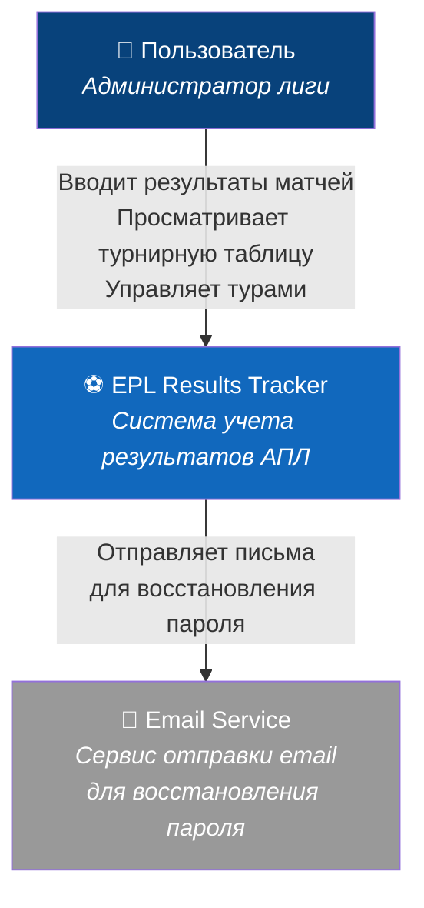
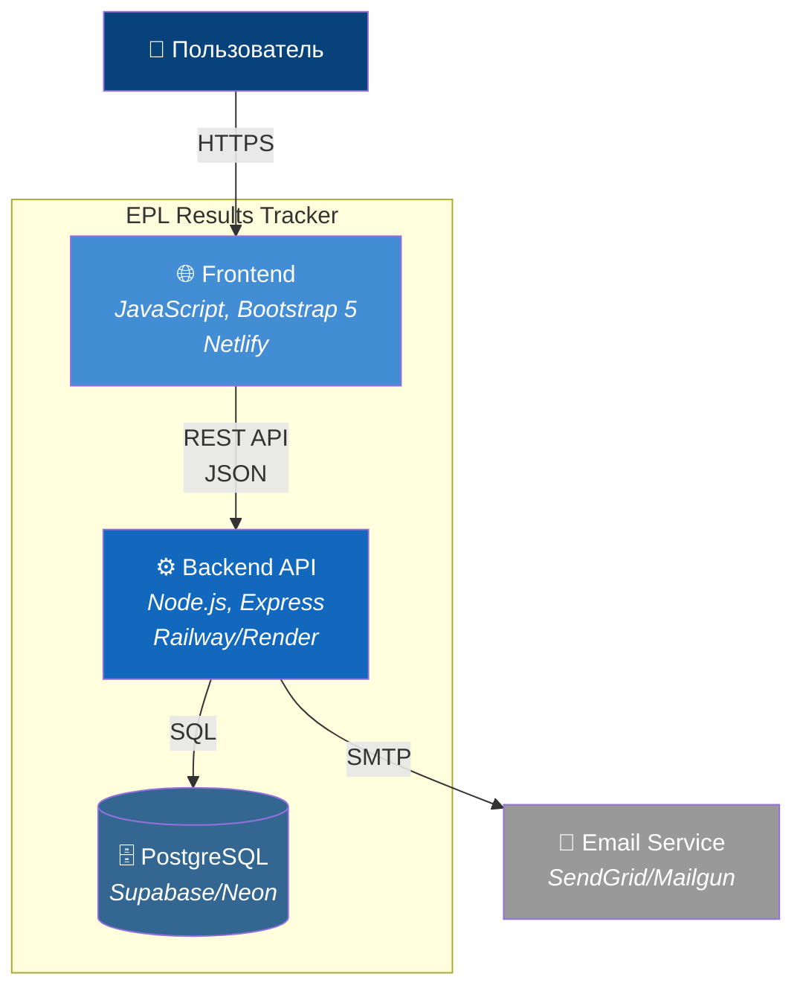

# Архитектура приложения

## 1. Общий обзор

EPL Results Tracker - это клиент-серверное веб-приложение с разделением frontend и backend частей, использующее облачную PostgreSQL базу данных для хранения данных.

### 1.1 C4 Context Diagram



### 1.2 C4 Container Diagram



## 2. Компоненты системы

### 2.1 Frontend (Клиентская часть)

#### Основные модули:
- **Auth Module:** Авторизация, работа с JWT токенами
- **Rounds Manager:** Управление 38 турами и формами матчей
- **Table Calculator:** Расчет и отображение турнирной таблицы
- **API Client:** Взаимодействие с backend через REST API
- **State Manager:** Управление состоянием приложения

#### Технологии:
- Vanilla JavaScript ES6+
- Bootstrap 5 для UI
- Fetch API для HTTP запросов
- LocalStorage для кеширования

### 2.2 Backend (Серверная часть)

#### Архитектура слоев:
```
┌─────────────────────────────────┐
│         Routes Layer            │  ← API endpoints
├─────────────────────────────────┤
│      Middleware Layer           │  ← Auth, validation, logging
├─────────────────────────────────┤
│     Controllers Layer           │  ← Business logic
├─────────────────────────────────┤
│       Services Layer            │  ← Data processing
├─────────────────────────────────┤
│        Models Layer             │  ← Database models
└─────────────────────────────────┘
```

#### Основные компоненты:
- **Authentication Service:** JWT генерация и валидация
- **Match Service:** CRUD операции для матчей
- **Table Service:** Расчет статистики команд
- **Email Service:** Отправка писем для восстановления пароля

### 2.3 База данных

PostgreSQL с следующими основными таблицами:
- `users` - данные пользователя
- `teams` - список команд АПЛ
- `matches` - результаты матчей
- `password_reset_tokens` - токены восстановления пароля

## 3. Поток данных

### 3.1 Авторизация
```
Пользователь → Login Form → API /auth/login → JWT Token → LocalStorage
                                ↓
                         Validate Credentials
                                ↓
                          PostgreSQL Check
```

### 3.2 Управление матчами
```
Add/Edit Match → Validate Input → API Request → Update Database
                                       ↓
                              Calculate Table Stats
                                       ↓
                              Return Updated Data → Update UI
```

### 3.3 Восстановление пароля
```
Request Reset → Generate Token → Save to DB → Send Email
                                      ↓
User Clicks Link → Validate Token → Update Password
```

## 4. API Endpoints

### Authentication
- `POST /api/auth/login` - вход в систему
- `POST /api/auth/logout` - выход
- `POST /api/auth/refresh` - обновление токена
- `POST /api/auth/forgot-password` - запрос восстановления
- `POST /api/auth/reset-password` - сброс пароля

### Matches
- `GET /api/matches` - получить все матчи
- `GET /api/matches/round/:round` - матчи конкретного тура
- `POST /api/matches` - добавить матч
- `PUT /api/matches/:id` - обновить матч
- `DELETE /api/matches/:id` - удалить матч

### Teams & Table
- `GET /api/teams` - список команд
- `GET /api/table` - турнирная таблица

## 5. Безопасность

### 5.1 Аутентификация
- JWT токены с временем жизни 24 часа
- Refresh токены для продления сессии
- Хеширование паролей bcrypt (10 rounds)

### 5.2 Защита API
- CORS политики
- Rate limiting (100 запросов/минута)
- Валидация входных данных
- SQL injection защита через параметризованные запросы

### 5.3 HTTPS
- Обязательное использование SSL
- HTTP Strict Transport Security (HSTS)

## 6. Масштабируемость и производительность

### 6.1 Оптимизации
- Кеширование статичных данных (список команд)
- Индексы в БД на часто используемых полях
- Минификация JS/CSS для production
- CDN для статических ресурсов

### 6.2 Мониторинг
- Логирование всех API запросов
- Отслеживание времени ответа
- Алерты при ошибках

## 7. Deployment Architecture

```
┌─────────────┐     ┌──────────────┐     ┌─────────────┐
│   Netlify   │────▶│Railway/Render│────▶│  Supabase   │
│  (Frontend) │     │  (Backend)   │     │(PostgreSQL) │
└─────────────┘     └──────────────┘     └─────────────┘
       ↓                    ↓                     
   Auto-deploy         Auto-deploy           
   from GitHub         from GitHub           
```

## 8. Ограничения текущей архитектуры

- Один сервер для backend (без load balancing)
- Отсутствие real-time обновлений (требуется refresh)
- Нет горизонтального масштабирования
- Ограниченные ресурсы на бесплатных планах хостинга
