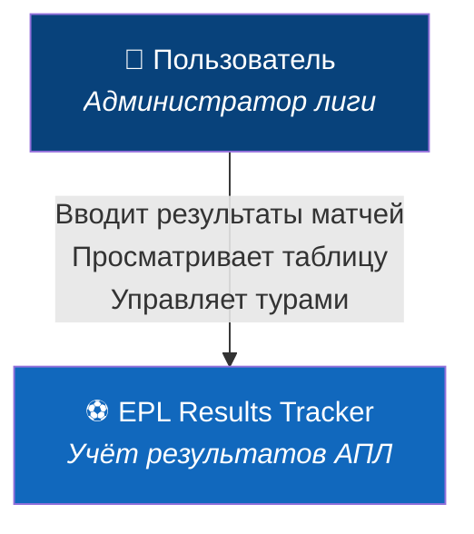
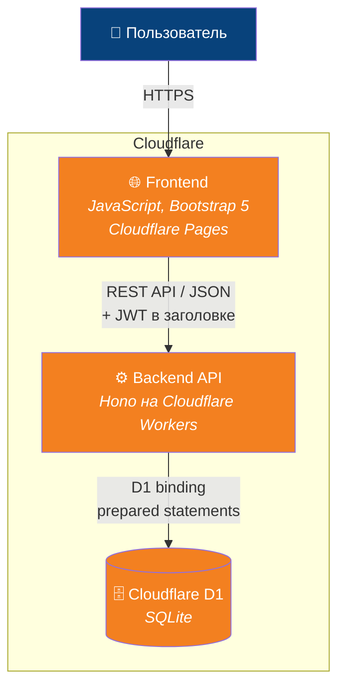
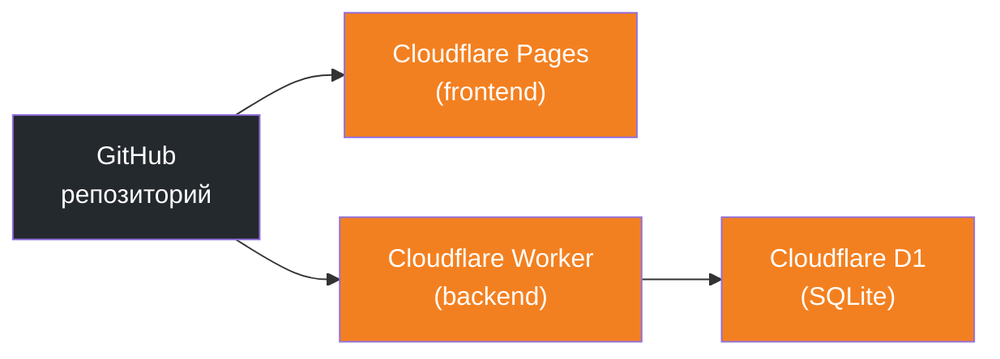

# Архитектура приложения

## 1. Общий обзор

EPL Results Tracker — это serverless клиент-серверное веб-приложение, полностью размещённое на платформе Cloudflare. Frontend — статический сайт на Cloudflare Pages, backend — Worker на фреймворке Hono, данные — в облачной SQLite-базе Cloudflare D1.

### 1.1 C4 Context Diagram


```mermaid
graph TB
    User["👤 Пользователь<br/><i>Администратор лиги</i>"]

    System["⚽ EPL Results Tracker<br/><i>Учёт результатов АПЛ</i>"]

    User -->|"Вводит результаты матчей<br/>Просматривает таблицу<br/>Управляет турами"| System

    style User fill:#08427b,color:#fff
    style System fill:#1168bd,color:#fff
```

Внешних сервисов нет: восстановление пароля по email исключено, всё работает в пределах Cloudflare.

### 1.2 C4 Container Diagram


```mermaid
graph TB
    User["👤 Пользователь"]

    subgraph "Cloudflare"
        Frontend["🌐 Frontend<br/><i>JavaScript, Bootstrap 5<br/>Cloudflare Pages</i>"]
        Backend["⚙️ Backend API<br/><i>Hono на Cloudflare Workers</i>"]
        Database[("🗄️ Cloudflare D1<br/><i>SQLite</i>")]
    end

    User -->|"HTTPS"| Frontend
    Frontend -->|"REST API / JSON<br/>+ JWT в заголовке"| Backend
    Backend -->|"D1 binding<br/>prepared statements"| Database

    style User fill:#08427b,color:#fff
    style Frontend fill:#F38020,color:#fff
    style Backend fill:#F38020,color:#fff
    style Database fill:#F38020,color:#fff
```

## 2. Компоненты системы

### 2.1 Frontend (Cloudflare Pages)

Статический сайт: HTML + CSS + JavaScript, без сборщика.

#### Основные модули:
- **Auth (`auth.js`):** вход, сохранение и подстановка JWT, выход
- **API Client (`api.js`):** обёртка над Fetch, добавляет `Authorization: Bearer <token>`, обрабатывает 401
- **Rounds (`rounds.js`):** селектор туров 1–38, список матчей выбранного тура, формы добавления/редактирования
- **Table (`table.js`):** отрисовка турнирной таблицы, автообновление после изменений

#### Технологии:
- Vanilla JavaScript ES6+
- Bootstrap 5
- Fetch API

### 2.2 Backend (Cloudflare Worker + Hono)

Worker выполняется на edge. Hono предоставляет роутинг и middleware — синтаксически близок к Express, но работает в среде Workers (без Node.js runtime).

#### Слои:
```
┌─────────────────────────────────┐
│         Routes (Hono)           │  ← API endpoints
├─────────────────────────────────┤
│  Middleware (CORS, JWT, валид.) │  ← hono/cors, hono/jwt
├─────────────────────────────────┤
│        Обработчики               │  ← бизнес-логика
├─────────────────────────────────┤
│      Сервис таблицы              │  ← расчёт статистики
├─────────────────────────────────┤
│       D1 binding                │  ← prepared statements
└─────────────────────────────────┘
```

Для простоты весь Worker размещён в одном файле `src/index.js`; при росте можно вынести роуты и сервисы в отдельные модули.

#### Ключевые компоненты:
- **Auth:** проверка логина/пароля (PBKDF2 через Web Crypto API), выдача JWT через `hono/jwt`
- **JWT middleware:** защита всех маршрутов, кроме `/api/auth/login` и `/api/health`
- **Match handlers:** CRUD-операции для матчей
- **Table service:** расчёт статистики и сортировка команд

### 2.3 База данных (Cloudflare D1)

D1 — это управляемый SQLite. Worker обращается к базе через binding `DB`, объявленный в `wrangler.toml`.

Основные таблицы:
- `users` — учётная запись администратора (хеш и соль пароля)
- `teams` — 20 команд АПЛ
- `matches` — результаты матчей

Подробная схема — в документе «Структура данных».

## 3. Поток данных

### 3.1 Авторизация
```
Пользователь → login.html → POST /api/auth/login → проверка хеша (PBKDF2)
                                   ↓
                            JWT (hono/jwt) → localStorage на клиенте
```

### 3.2 Управление матчами
```
Добавить/изменить матч → валидация на клиенте → запрос с JWT
        → JWT middleware → валидация на сервере → запись в D1
        → клиент запрашивает GET /api/table → пересчёт → обновление UI
```

## 4. API Endpoints

Все маршруты, кроме `/api/health` и `/api/auth/login`, требуют заголовок `Authorization: Bearer <JWT>`.

### Authentication
- `POST /api/auth/login` — вход (логин + пароль), возвращает JWT

### Matches
- `GET /api/matches` — все матчи
- `GET /api/matches/round/:round` — матчи конкретного тура
- `POST /api/matches` — добавить матч
- `PUT /api/matches/:id` — обновить матч
- `DELETE /api/matches/:id` — удалить матч

### Teams & Table
- `GET /api/teams` — список команд
- `GET /api/table` — турнирная таблица (рассчитывается на сервере)

### Служебные
- `GET /api/health` — проверка работоспособности

## 5. Безопасность

### 5.1 Аутентификация
- Пароль хранится как хеш PBKDF2 (SHA-256) с солью; вычисляется через Web Crypto API (встроен в Workers, без внешних библиотек)
- JWT подписывается серверным секретом `JWT_SECRET`
- Срок жизни JWT — 24 часа; восстановления пароля нет (учётные данные заданы заранее)

### 5.2 Защита API
- CORS-политика (`hono/cors`) разрешает запросы только с домена frontend
- Валидация всех входных данных
- Параметризованные запросы D1 (защита от SQL-инъекций)

### 5.3 Секреты
- `JWT_SECRET` хранится через `wrangler secret put` — не в коде и не в git
- Локальные секреты — в `.dev.vars` (добавлен в `.gitignore`)

### 5.4 HTTPS
- Обеспечивается Cloudflare автоматически для `*.pages.dev` и `*.workers.dev`

## 6. Производительность

- Edge-выполнение Worker без cold start
- Индексы D1 на часто используемых полях (`round`, `home_team_id`, `away_team_id`)
- Кеширование статичных данных (список команд) на клиенте
- Безлимитный трафик на бесплатном тарифе Cloudflare Pages

## 7. Deployment Architecture


```mermaid
graph LR
    GH["GitHub<br/>репозиторий"] --> Pages["Cloudflare Pages<br/>(frontend)"]
    GH --> Worker["Cloudflare Worker<br/>(backend)"]
    Worker --> D1["Cloudflare D1<br/>(SQLite)"]

    style GH fill:#24292e,color:#fff
    style Pages fill:#F38020,color:#fff
    style Worker fill:#F38020,color:#fff
    style D1 fill:#F38020,color:#fff
```

- Frontend: авто-деплой из GitHub через Cloudflare Pages (или `wrangler pages deploy`)
- Backend: деплой Worker через `wrangler deploy`
- БД: создание и миграции через `wrangler d1`

## 8. Ограничения текущей архитектуры

- Один пользователь, без ролей и многопользовательского режима
- Нет real-time обновлений между устройствами (данные обновляются при действии/перезагрузке)
- D1 — единая база без репликации на бесплатном тарифе
- Лимиты бесплатного тарифа Cloudflare (с большим запасом для данного объёма данных)
