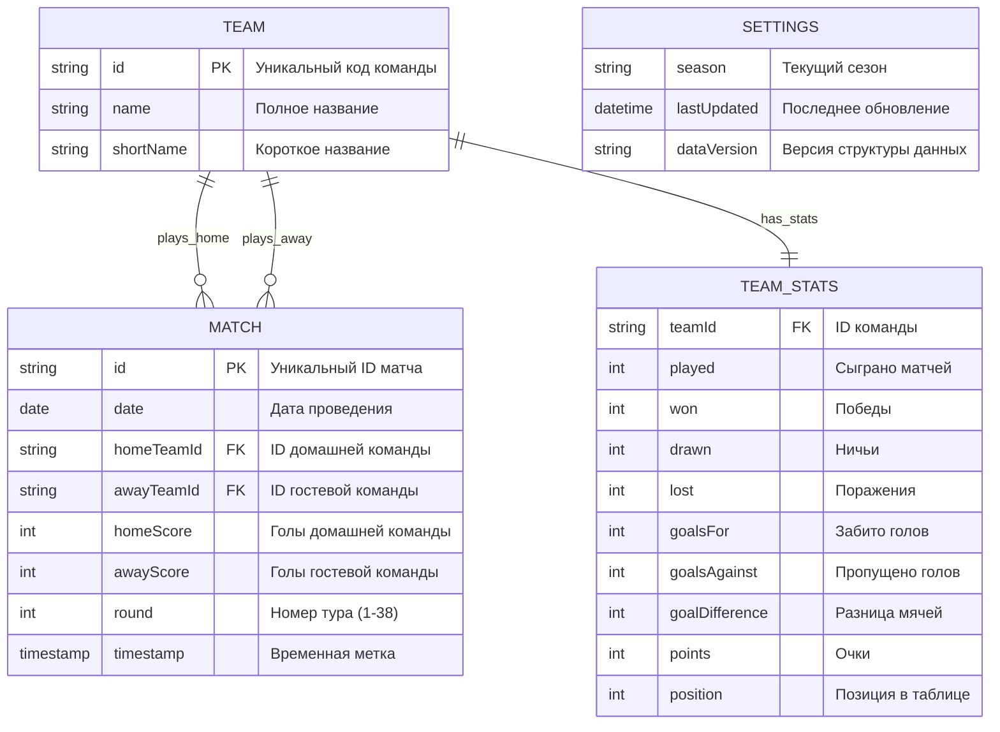

# Структура данных

## 1. Обзор

Все данные хранятся в localStorage в формате JSON. Используются три основных коллекции:
- `epl_teams` - список команд
- `epl_matches` - результаты матчей
- `epl_settings` - настройки приложения

## 2. Модели данных

### 2.1 Команда (Team)

```json
{
  "id": "MCI",
  "name": "Manchester City",
  "shortName": "Man City"
}
```

### 2.2 Матч (Match)

```json
{
  "id": "match_001",
  "date": "2024-08-16",
  "homeTeamId": "MCI",
  "awayTeamId": "CHE",
  "homeScore": 2,
  "awayScore": 1,
  "round": 1,
  "timestamp": 1723833600000
}
```

### 2.3 Статистика команды (TeamStats)

```json
{
  "teamId": "MCI",
  "played": 10,
  "won": 7,
  "drawn": 2,
  "lost": 1,
  "goalsFor": 25,
  "goalsAgainst": 8,
  "goalDifference": 17,
  "points": 23,
  "position": 1
}
```

## 3. ER-диаграмма



### Описание связей:
- Каждая команда может играть множество матчей дома и в гостях
- Каждый матч связан с двумя командами (домашняя и гостевая)
- Каждая команда имеет одну запись статистики, которая рассчитывается динамически
- Настройки приложения хранятся отдельно и не связаны с другими сущностями

## 4. Структура хранилища

### 4.1 Список команд АПЛ 2024/2025

```json
{
  "epl_teams": [
    {"id": "ARS", "name": "Arsenal", "shortName": "Arsenal"},
    {"id": "AVL", "name": "Aston Villa", "shortName": "Aston Villa"},
    {"id": "BOU", "name": "Bournemouth", "shortName": "Bournemouth"},
    {"id": "BRE", "name": "Brentford", "shortName": "Brentford"},
    {"id": "BHA", "name": "Brighton & Hove Albion", "shortName": "Brighton"},
    {"id": "CHE", "name": "Chelsea", "shortName": "Chelsea"},
    {"id": "CRY", "name": "Crystal Palace", "shortName": "Crystal Palace"},
    {"id": "EVE", "name": "Everton", "shortName": "Everton"},
    {"id": "FUL", "name": "Fulham", "shortName": "Fulham"},
    {"id": "IPS", "name": "Ipswich Town", "shortName": "Ipswich"},
    {"id": "LEI", "name": "Leicester City", "shortName": "Leicester"},
    {"id": "LIV", "name": "Liverpool", "shortName": "Liverpool"},
    {"id": "MCI", "name": "Manchester City", "shortName": "Man City"},
    {"id": "MUN", "name": "Manchester United", "shortName": "Man United"},
    {"id": "NEW", "name": "Newcastle United", "shortName": "Newcastle"},
    {"id": "NFO", "name": "Nottingham Forest", "shortName": "Nott'm Forest"},
    {"id": "SOU", "name": "Southampton", "shortName": "Southampton"},
    {"id": "TOT", "name": "Tottenham Hotspur", "shortName": "Tottenham"},
    {"id": "WHU", "name": "West Ham United", "shortName": "West Ham"},
    {"id": "WOL", "name": "Wolverhampton", "shortName": "Wolves"}
  ]
}
```

### 4.2 Коллекция матчей

```json
{
  "epl_matches": [
    {
      "id": "match_001",
      "date": "2024-08-16",
      "homeTeamId": "MCI",
      "awayTeamId": "CHE",
      "homeScore": 2,
      "awayScore": 1,
      "round": 1,
      "timestamp": 1723833600000
    }
  ]
}
```

### 4.3 Настройки приложения

```json
{
  "epl_settings": {
    "season": "2024/2025",
    "lastUpdated": "2024-08-16T15:30:00Z",
    "dataVersion": "1.0"
  }
}
```

## 5. Правила расчета

### 5.1 Начисление очков
- Победа: 3 очка
- Ничья: 1 очко
- Поражение: 0 очков

### 5.2 Критерии сортировки таблицы
1. Количество очков (по убыванию)
2. Разница забитых и пропущенных мячей (по убыванию)
3. Количество забитых мячей (по убыванию)
4. Алфавитный порядок названия команды

## 6. Функции работы с данными

### 6.1 Сохранение данных
```javascript
localStorage.setItem('epl_matches', JSON.stringify(matches));
```

### 6.2 Загрузка данных
```javascript
const matches = JSON.parse(localStorage.getItem('epl_matches') || '[]');
```

### 6.3 Экспорт данных
```javascript
const exportData = {
  version: "1.0",
  exportDate: new Date().toISOString(),
  teams: teams,
  matches: matches,
  settings: settings
};
```

## 7. Валидация данных

- ID команды должен существовать в списке команд
- Счет не может быть отрицательным
- Дата матча должна быть валидной
- Команда не может играть сама с собой
- ID матча должен быть уникальным