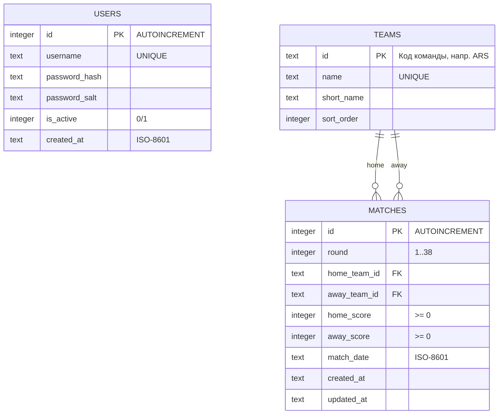

# Структура данных

## 1. Обзор

Данные хранятся в облачной базе **Cloudflare D1** (управляемый SQLite). Используются три таблицы:
- `users` — учётная запись администратора
- `teams` — команды АПЛ
- `matches` — результаты матчей

Статистика команд (турнирная таблица) **не хранится** в БД, а рассчитывается на сервере «на лету» из таблицы `matches` при каждом запросе `GET /api/table`.

Особенности SQLite (в отличие от PostgreSQL): нет отдельного типа BOOLEAN (используется INTEGER 0/1), нет типа TIMESTAMP (используется TEXT в формате ISO-8601), автоинкремент через `INTEGER PRIMARY KEY AUTOINCREMENT`.

## 2. Схема базы данных (schema.sql)

```sql
-- Включить проверку внешних ключей
PRAGMA foreign_keys = ON;

-- Пользователи (учётная запись администратора)
CREATE TABLE IF NOT EXISTS users (
    id            INTEGER PRIMARY KEY AUTOINCREMENT,
    username      TEXT    NOT NULL UNIQUE,
    password_hash TEXT    NOT NULL,
    password_salt TEXT    NOT NULL,
    is_active     INTEGER NOT NULL DEFAULT 1,   -- 0/1 вместо BOOLEAN
    created_at    TEXT    NOT NULL DEFAULT (datetime('now'))
);

-- Команды АПЛ
CREATE TABLE IF NOT EXISTS teams (
    id         TEXT PRIMARY KEY,   -- 3-буквенный код, напр. 'ARS'
    name       TEXT NOT NULL UNIQUE,
    short_name TEXT,
    sort_order INTEGER
);

-- Матчи
CREATE TABLE IF NOT EXISTS matches (
    id           INTEGER PRIMARY KEY AUTOINCREMENT,
    round        INTEGER NOT NULL CHECK (round BETWEEN 1 AND 38),
    home_team_id TEXT    NOT NULL REFERENCES teams(id),
    away_team_id TEXT    NOT NULL REFERENCES teams(id),
    home_score   INTEGER NOT NULL DEFAULT 0 CHECK (home_score >= 0),
    away_score   INTEGER NOT NULL DEFAULT 0 CHECK (away_score >= 0),
    match_date   TEXT    NOT NULL,             -- ISO-8601, напр. '2026-08-22'
    created_at   TEXT    NOT NULL DEFAULT (datetime('now')),
    updated_at   TEXT    NOT NULL DEFAULT (datetime('now')),
    CHECK (home_team_id <> away_team_id),
    UNIQUE (round, home_team_id, away_team_id)
);

-- Индексы для ускорения выборок
CREATE INDEX IF NOT EXISTS idx_matches_round ON matches(round);
CREATE INDEX IF NOT EXISTS idx_matches_home  ON matches(home_team_id);
CREATE INDEX IF NOT EXISTS idx_matches_away  ON matches(away_team_id);
```

## 3. ER-диаграмма


```mermaid
erDiagram
    USERS {
        integer id PK "AUTOINCREMENT"
        text username "UNIQUE"
        text password_hash
        text password_salt
        integer is_active "0/1"
        text created_at "ISO-8601"
    }

    TEAMS {
        text id PK "Код команды, напр. ARS"
        text name "UNIQUE"
        text short_name
        integer sort_order
    }

    MATCHES {
        integer id PK "AUTOINCREMENT"
        integer round "1..38"
        text home_team_id FK
        text away_team_id FK
        integer home_score ">= 0"
        integer away_score ">= 0"
        text match_date "ISO-8601"
        text created_at
        text updated_at
    }

    TEAMS ||--o{ MATCHES : "home"
    TEAMS ||--o{ MATCHES : "away"
```

### Описание связей
- Каждый матч ссылается на две команды (домашнюю и гостевую) через внешние ключи на `teams(id)`
- Ограничение `CHECK (home_team_id <> away_team_id)` запрещает игру команды самой с собой
- Ограничение `UNIQUE (round, home_team_id, away_team_id)` запрещает дубль одной пары в одном туре
- Таблица `users` не связана с остальными (одна учётная запись администратора)

## 4. Начальные данные (seed.sql)

### 4.1 Команды АПЛ 2026/2027

```sql
INSERT INTO teams (id, name, short_name, sort_order) VALUES
('ARS', 'Arsenal', 'Arsenal', 1),
('AVL', 'Aston Villa', 'Aston Villa', 2),
('BOU', 'Bournemouth', 'Bournemouth', 3),
('BRE', 'Brentford', 'Brentford', 4),
('BHA', 'Brighton & Hove Albion', 'Brighton', 5),
('CHE', 'Chelsea', 'Chelsea', 6),
('COV', 'Coventry City', 'Coventry', 7),
('CRY', 'Crystal Palace', 'Crystal Palace', 8),
('EVE', 'Everton', 'Everton', 9),
('FUL', 'Fulham', 'Fulham', 10),
('HUL', 'Hull City', 'Hull', 11),
('IPS', 'Ipswich Town', 'Ipswich', 12),
('LEE', 'Leeds United', 'Leeds', 13),
('LIV', 'Liverpool', 'Liverpool', 14),
('MCI', 'Manchester City', 'Man City', 15),
('MUN', 'Manchester United', 'Man United', 16),
('NEW', 'Newcastle United', 'Newcastle', 17),
('NFO', 'Nottingham Forest', 'Nott''m Forest', 18),
('SUN', 'Sunderland', 'Sunderland', 19),
('TOT', 'Tottenham Hotspur', 'Tottenham', 20);
```

> Примечание: по итогам сезона 2025/2026 в АПЛ зашли Coventry City, Ipswich Town и Hull City, заменив West Ham United, Burnley и Wolverhampton Wanderers. В сезоне 2026/2027 впервые в истории АПЛ нет ни одной команды на букву «W».

### 4.2 Учётная запись администратора

Запись добавляется **из приложения или скрипта**, а не вручную в SQL, потому что хеш и соль пароля вычисляются через Web Crypto API (PBKDF2). Хранить пароль в открытом виде в seed-файле нельзя.

Логика:
1. Сгенерировать случайную соль
2. Вычислить `password_hash = PBKDF2(password, salt)`
3. Вставить запись:
```sql
INSERT INTO users (username, password_hash, password_salt, is_active)
VALUES ('admin', :hash, :salt, 1);
```

## 5. Правила расчёта таблицы

### 5.1 Начисление очков
- Победа: 3 очка
- Ничья: 1 очко
- Поражение: 0 очков

### 5.2 Вычисляемые показатели (на сервере)
Для каждой команды по таблице `matches`:
- **P** — сыграно матчей
- **W / D / L** — победы / ничьи / поражения
- **GF / GA** — забито / пропущено
- **GD** — разница мячей (GF − GA)
- **Pts** — очки (W×3 + D×1)

### 5.3 Критерии сортировки
1. Очки (по убыванию)
2. Разница мячей (по убыванию)
3. Забитые мячи (по убыванию)
4. Алфавитный порядок названия команды

## 6. Доступ к данным из Worker

D1 вызывается через binding `DB` с prepared statements:

```js
// Выборка матчей тура
const { results } = await c.env.DB
  .prepare('SELECT * FROM matches WHERE round = ? ORDER BY match_date')
  .bind(round)
  .all();

// Вставка матча
await c.env.DB
  .prepare(`INSERT INTO matches
            (round, home_team_id, away_team_id, home_score, away_score, match_date)
            VALUES (?, ?, ?, ?, ?, ?)`)
  .bind(round, homeId, awayId, homeScore, awayScore, matchDate)
  .run();
```

Параметры всегда передаются через `.bind()` — это защищает от SQL-инъекций.

## 7. Валидация данных

- `round` — целое от 1 до 38
- `home_score`, `away_score` — целые ≥ 0
- `home_team_id` и `away_team_id` должны существовать в `teams` и быть различными
- `match_date` — корректная дата в формате ISO-8601
- Пара команд уникальна в пределах тура

Валидация выполняется и на клиенте (для UX), и на сервере (как источник истины). Ограничения БД (`CHECK`, `UNIQUE`, `REFERENCES`) — последний рубеж защиты.
