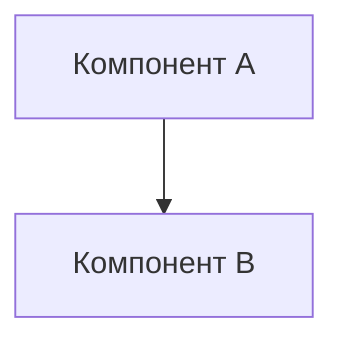

# Руководство разработчика

## 1. Структура проекта

```
epl-results-tracker/
├── index.html              # Главная страница приложения
├── css/
│   └── styles.css         # Пользовательские стили
├── js/
│   ├── app.js            # Точка входа, инициализация
│   ├── data.js           # Работа с localStorage
│   ├── ui.js             # Управление интерфейсом
│   ├── calculator.js     # Расчет турнирной таблицы
│   └── validator.js      # Валидация данных
├── data/
│   └── teams.json        # Статический список команд
└── docs/                 # Документация проекта
```

## 2. Архитектура кода

### 2.1 Модульная организация

**app.js** - Главный модуль
```javascript
// Инициализация приложения
// Подключение обработчиков событий
// Координация между модулями
```

**data.js** - Управление данными
```javascript
// Функции для работы с localStorage
// CRUD операции для матчей
// Экспорт/импорт данных
```

**ui.js** - Интерфейс
```javascript
// Отрисовка таблиц
// Обновление DOM элементов
// Управление формами
```

**calculator.js** - Бизнес-логика
```javascript
// Расчет статистики команд
// Сортировка турнирной таблицы
// Применение правил АПЛ
```

**validator.js** - Валидация
```javascript
// Проверка вводимых данных
// Валидация дат и счета
// Проверка уникальности
```

### 2.2 Основные функции

```javascript
// data.js
function saveMatch(match) { }
function getMatches() { }
function deleteMatch(matchId) { }
function exportData() { }
function importData(jsonData) { }

// calculator.js
function calculateTable(matches) { }
function sortTeams(teams) { }
function getTeamStats(teamId, matches) { }

// ui.js
function renderTable(tableData) { }
function renderMatches(matches) { }
function showMessage(text, type) { }
```

## 3. Добавление новых функций

### 3.1 Пример: Добавление фильтра по турам

1. **Добавить UI элемент в index.html:**
```html
<select id="roundFilter" class="form-select">
  <option value="">Все туры</option>
  <option value="1">Тур 1</option>
  <!-- ... -->
</select>
```

2. **Добавить функцию фильтрации в data.js:**
```javascript
function getMatchesByRound(round) {
  const matches = getMatches();
  if (!round) return matches;
  return matches.filter(m => m.round === parseInt(round));
}
```

3. **Обновить отображение в ui.js:**
```javascript
document.getElementById('roundFilter').addEventListener('change', (e) => {
  const filteredMatches = getMatchesByRound(e.target.value);
  renderMatches(filteredMatches);
});
```

### 3.2 Пример: Добавление статистики "дома/в гостях"

1. **Расширить calculator.js:**
```javascript
function getHomeAwayStats(teamId, matches) {
  const homeMatches = matches.filter(m => m.homeTeamId === teamId);
  const awayMatches = matches.filter(m => m.awayTeamId === teamId);
  // Расчет отдельной статистики
  return { home: homeStats, away: awayStats };
}
```

2. **Обновить отображение таблицы**

## 4. Работа с данными

### 4.1 Схема хранения
```javascript
// Ключи localStorage
const STORAGE_KEYS = {
  TEAMS: 'epl_teams',
  MATCHES: 'epl_matches',
  SETTINGS: 'epl_settings'
};
```

### 4.2 Миграция данных
При изменении структуры данных:
```javascript
function migrateData() {
  const version = getDataVersion();
  if (version < '2.0') {
    // Применить миграцию
    updateDataStructure();
    setDataVersion('2.0');
  }
}
```

## 5. Стилизация

### 5.1 CSS структура
```css
/* Базовые стили */
:root {
  --primary-color: #38003c;  /* Цвет АПЛ */
  --success-color: #00ff87;
}

/* Компонентные стили */
.match-form { }
.results-table { }
.league-table { }
```

### 5.2 Bootstrap кастомизация
- Используйте Bootstrap утилиты для отступов и выравнивания
- Переопределяйте только необходимые стили
- Сохраняйте адаптивность

## 6. Отладка и тестирование

### 6.1 Консольные команды для отладки
```javascript
// Добавить в app.js для отладки
window.debug = {
  clearData: () => localStorage.clear(),
  showData: () => console.log(getAllData()),
  addTestMatches: () => addRandomMatches(10)
};
```

### 6.2 Проверка localStorage
```javascript
// Просмотр всех данных
Object.keys(localStorage).forEach(key => {
  console.log(key, JSON.parse(localStorage.getItem(key)));
});
```

## 7. Оптимизация производительности

- **Кэширование DOM элементов** - сохраняйте ссылки на часто используемые элементы
- **Batch обновления** - обновляйте UI одним вызовом, а не по частям
- **Debounce для поиска** - если добавите поиск, используйте задержку

## 8. Возможные улучшения

### 8.1 Краткосрочные
- [ ] Поиск по командам
- [ ] Фильтр по датам
- [ ] Печать турнирной таблицы
- [ ] Темная тема
- [ ] Горячие клавиши

### 8.2 Долгосрочные
- [ ] PWA функциональность (offline режим)
- [ ] Графики и визуализация (Chart.js)
- [ ] Интеграция с Football API
- [ ] Мультиязычность
- [ ] История изменений позиций

## 9. Работа с диаграммами

### 9.1 Обновление диаграмм
Проект использует Mermaid для диаграмм в документации:
- **C4 Context** - в файле `ARCHITECTURE.md`
- **ER-диаграмма** - в файле `DATA_STRUCTURE.md`

### 9.2 Просмотр диаграмм
- GitHub автоматически рендерит Mermaid диаграммы
- Для локального просмотра используйте VS Code с расширением Mermaid
- Или онлайн редактор: [Mermaid Live Editor](https://mermaid.live/)

### 9.3 Синтаксис


## 10. FAQ для разработчиков

**Q: Как добавить новую команду?**
A: Обновите файл `data/teams.json` и переинициализируйте приложение.

**Q: Можно ли использовать базу данных вместо localStorage?**
A: Да, но потребуется backend. Рассмотрите Firebase или Supabase для быстрого старта.

**Q: Как добавить автоматическое обновление результатов?**
A: Интегрируйте Football-data API или используйте n8n для периодического скрапинга.

## 11. Полезные ресурсы

- [MDN Web Docs - localStorage](https://developer.mozilla.org/en-US/docs/Web/API/Window/localStorage)
- [Bootstrap 5 Documentation](https://getbootstrap.com/docs/5.0/)
- [Premier League Official Site](https://www.premierleague.com/)
- [StatiCrypt GitHub](https://github.com/robinmoisson/staticrypt)
- [Mermaid Diagram Syntax](https://mermaid.js.org/) - для обновления диаграмм
- [C4 Model](https://c4model.com/) - методология архитектурных диаграмм